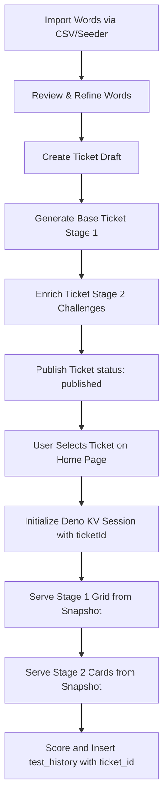

# ELX End-to-End Business Process Flow

This document details the ticket-driven vocabulary testing process, from initial
word bank curation to final test score recording.

---

## 1. Word Bank Curation & Review

The foundation of ELX is a curated word bank consisting of real English words
and phonetically plausible pseudowords.

1. **CSV/Seed Import**: Administrators upload word lists via the Admin dashboard
   (`/admin/words/import`) or run seeder scripts. Imported words are set with a
   base difficulty (1–5) and whether they are real.
2. **Word Review & Refinement**: Through the Admin UI, administrators review
   newly added words, skipping or confirming their suitability to ensure only
   high-quality items are used.

## 2. Ticket Composition & Two-Phase Generation

Rather than selecting words dynamically from the database for each user, ELX
serves pre-configured, immutable **Test Tickets**. This guarantees deterministic
tests and avoids runtime database joins.

1. **Create Draft**: The admin creates a new ticket, specifying a `code` (e.g.
   `ELX-T-0001`), title, and optional description or notes. The ticket starts in
   the `draft` status.
2. **Phase 1 - Base Generation**:
   - Based on composition settings (e.g. difficulty distribution, target word
     count, real/pseudoword ratio), the system queries matching words from the
     PostgreSQL database.
   - The selected words are snapshot and appended to the ticket's `questions`
     JSONB array as `verification` type questions.
   - The ticket status advances to `base`.
3. **Phase 2 - Enrichment**:
   - The system retrieves context sentences, spelling distractors, synonyms, and
     definitions for the base words using offline scripts/apis (e.g. Datamuse,
     dictionary APIs).
   - The enriched question metadata is appended to the ticket's `questions`
     array.
   - Once all stages have complete snapshots, the ticket status changes to
     `complete`.

## 3. Publication & Immutability

1. **Publishing**: The admin reviews the complete ticket and clicks "Publish" in
   the Admin Panel.
2. **Status Shift**: The status changes to `published`.
3. **Immutability Lock**: Once published, a ticket is locked. No edits are
   allowed, and its `questions` JSONB snapshot remains permanently frozen. This
   ensures all users taking this ticket receive the exact same sequence of
   questions.

## 4. User Test Session Execution

When a user participates in the LexTALE assessment, they interact with the
published tickets.

1. **Ticket Selection**:
   - The home page (`/`) retrieves all published tickets and renders a dropdown.
   - The user selects a ticket (or the system automatically selects one via
     auto-assignment).
   - If no published tickets exist in the system, a fallback default ticket is
     automatically generated and published.
2. **Session Initialization**:
   - Submitting the form on the home page makes a `POST /stage/1/start` request.
   - This initializes a new session ID, sets a `Set-Cookie: sessionId=...`
     header, and stores the selected `ticketId` under the session state in Deno
     KV.
3. **Serving Stage 1 (Word Grid)**:
   - When the user navigates to `/stage/1`, the system reads the `ticketId` from
     Deno KV.
   - It retrieves the ticket from PostgreSQL and parses the `questions` array.
   - All `verification` questions in the snapshot are served as checkboxes. The
     `id` of each word checkbox is its index in the ticket's snapshot array.
4. **Serving Stage 2 (Card Verification)**:
   - When the user submits the checked words, the system saves the indices of
     the selected words in Deno KV and redirects to `/stage/2`.
   - `/stage/2` iterates through the selected words one-by-one using HTMX.
   - For each word, it renders a "Know / Don't Know" question card. The content
     is loaded directly from the ticket's snapshot question at the saved index.

## 5. Attempt Scoring & History Recording

1. **Scoring**:
   - When the last card is submitted, the server calculates the LexTALE score
     and truthfulness metrics.
   - Scoring runs purely on the server using the snapshot definitions.
2. **Recording**:
   - The completed test attempt is saved to the `test_history` table in
     PostgreSQL.
   - The record includes the session's score, truthfulness, timestamp, and a
     reference to the `ticket_id`. This allows administrators to track
     performance metrics per-ticket.
   - The user is redirected to the `/result` page showing their final metrics.
