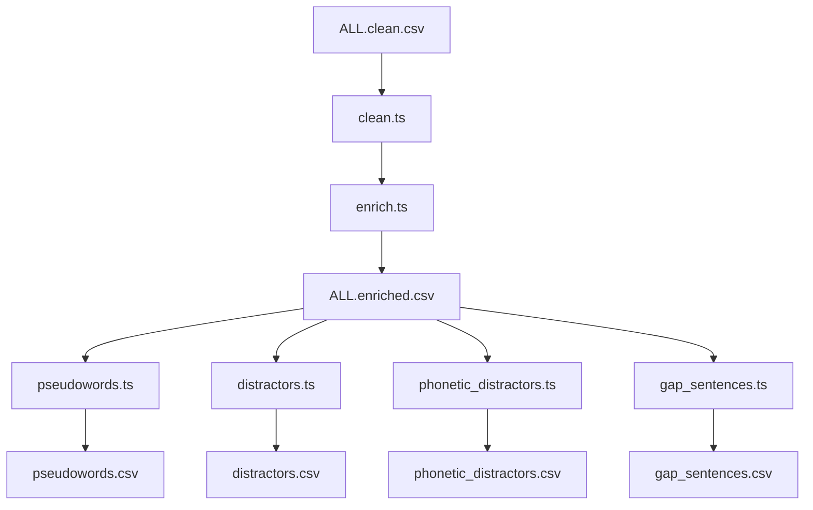

# Vocabulary Enrichment Pipeline (Enrichers)

This page documents the offline vocabulary enrichment pipeline (the "magic-hat"
scripts) used to clean, enrich, and generate distractors and context sentences
for the vocabulary assessment question bank.

All pipeline operations run completely **offline** to ensure reproducible, fast,
and network-independent builds.

---

## Pipeline Overview

The pipeline processes a cleaned wordlist and outputs intermediate enriched data
and final question-bank artifacts. The execution order is as follows:



---

## 1. Input and Intermediate Datasets

### `ALL.clean.csv`

- **Description**: The raw cleaned vocabulary wordlist.
- **Source**: Produced by the cleaning script `scripts/clean.ts` from imported
  sources.
- **Location**: `scripts/magic-hat/ALL.clean.csv`

### `ALL.enriched.csv`

- **Description**: The enriched vocabulary database. Contains metadata,
  definitions, synonyms, antonyms, and statistical frequencies for all real
  words.
- **Source**: Produced by the enrichment script `scripts/enrich.ts`.
- **Location**: `scripts/magic-hat/ALL.enriched.csv`

---

## 2. Enrichment Scripts

### A. Cleaning (`scripts/clean.ts`)

Filters and normalizes imported raw headwords.

- **Rules**:
  - Excludes abbreviations and acronyms (e.g. `a.m.`, `DVD`).
  - Excludes multi-word items (e.g. `alarm clock`) and hyphenated terms (e.g.
    `brand-new`).
  - Resolves slash-variants (e.g. `adviser/advisor` $\to$ `adviser`).
  - Checks for valid Part of Speech (POS) classes and drops non-lexical classes
    (e.g. determiners, pronouns).

### B. Enrichment (`scripts/enrich.ts`)

Enriches clean words with semantic information and frequency/difficulty metrics.

- **WordNet Lookup**: Extracts definitions, synonyms, antonyms, hypernyms, and
  `lexname` semantic category tags using the local `rabbits` WordNet dictionary
  index.
- **Difficulty and Zipf Scale**:
  - Computes `Zipf = log10(SUBTLWF) + 3` based on the SUBTLEX-US database
    (`scripts/magic-hat/subtlex/SUBTLEXus74286wordstextversion.txt`).
  - Assigns difficulty grades (1-5) primarily based on the CEFR band (`A1 -> 1`
    to `B2 -> 4`), with Zipf frequency backfilling missing CEFR values.
- **Command**:
  ```bash
  deno run --allow-read --allow-write scripts/enrich.ts --format csv
  ```

### C. Pseudoword Generation (`scripts/pseudowords.ts`)

Generates realistic non-real words (pseudowords) for vocabulary size check
tasks.

- **Markov Model**: Uses a character-bigram Markov chain model trained over the
  real words dataset.
- **Constraints**:
  - Matches the length, difficulty, and CV (Consonant-Vowel) pattern of sampled
    real target words (with a fallback to length-only if the CV pattern cannot
    be satisfied).
  - Validates that the generated candidate does not exist in the WordNet
    `rabbits` dictionary.
  - Runs deterministically under a seeded RNG.
- **Command**:
  ```bash
  deno run --allow-read --allow-write scripts/pseudowords.ts --count 100 --seed 12345
  ```

### D. Semantic Distractors (`scripts/distractors.ts`)

Generates plausible but wrong choices for Stage 3 & 5 synonym and definition
tests.

- **Rules**:
  - Selects 3 real-word distractors sharing the exact same Part of Speech (POS)
    and CEFR band.
  - Excludes the target word itself and any of the target's synonyms, antonyms,
    or hypernyms.
  - In definition mode, prioritizes candidates sharing the same `lexname` (e.g.
    matching `verb.possession` or `noun.animal`) for semantic plausibility.
- **Command**:
  ```bash
  deno run --allow-read --allow-write scripts/distractors.ts --seed 12345
  ```

### E. Phonetic Distractors (`scripts/phonetic_distractors.ts`)

Generates spelling distractors for Stage 4 spelling tests.

- **Rules**:
  - Selects 3 similar-sounding or similar-spelled real words sharing the same
    Part of Speech (POS).
  - Ranks candidates by:
    1. Metaphone equivalence.
    2. Levenshtein edit distance over IPA pronunciation keys.
    3. Levenshtein edit distance over orthography (spelling).
- **Command**:
  ```bash
  deno run --allow-read --allow-write scripts/phonetic_distractors.ts
  ```

### F. Gap Sentences (`scripts/gap_sentences.ts`)

Generates context-rich sentences with a single gap for spelling/cloze tests.

- **Rules**:
  - Extracts WordNet examples from `ALL.enriched.csv`.
  - Replaces the headword or its inflected forms (s, es, ed, d, ing, ies, ied)
    case-insensitively with a single `___`.
  - Backfills words lacking a usable WordNet example using a pre-filtered
    offline Tatoeba English sentences subset
    (`scripts/magic-hat/tatoeba/eng_sentences_filtered.tsv`).
  - Ensures the sentence contains exactly one gap and does not leak the target
    word.
- **Command**:
  ```bash
  deno run --allow-read --allow-write scripts/gap_sentences.ts
  ```

---

## 3. Output Artifacts

Each generator produces a standalone CSV file under `scripts/magic-hat/`:

### `pseudowords.csv`

- **Columns**: `value,is_real,difficulty,synonyms,antonyms,definition`
- **Example**: `plimber,false,2,,,`

### `distractors.csv`

- **Columns**: `headword,pos,CEFR,definition_distractors,synonym_distractors`
- **Example**: `abandon,verb,B1,discard; dump; yield,forsake; leave; surrender`

### `phonetic_distractors.csv`

- **Columns**: `headword,pos,CEFR,pronunciation,phonetic_distractors`
- **Example**: `accept,verb,B1,ækˈsɛpt,except; expect; access`

### `gap_sentences.csv`

- **Columns**: `headword,pos,CEFR,gap_sentence`
- **Example**: `abandon,verb,B1,We ___ the old car in the empty parking lot.`
