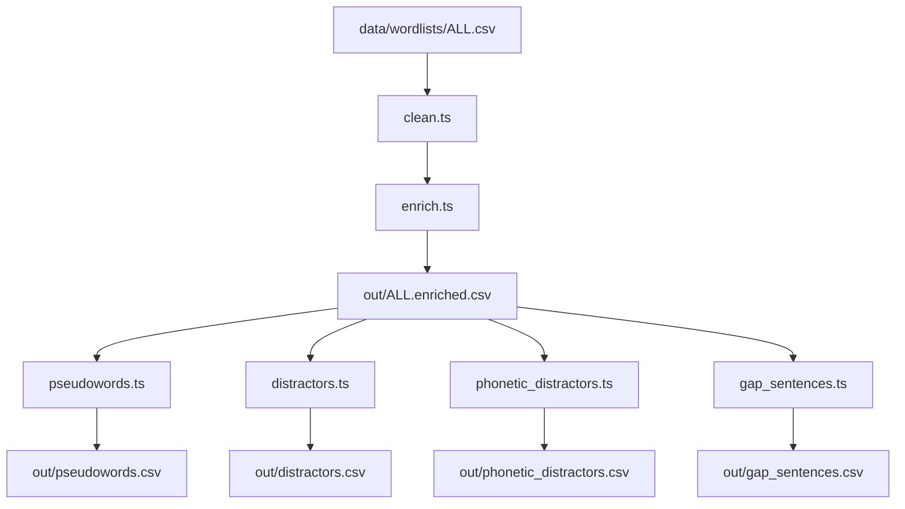

# Vocabulary enrichment pipeline

Offline tooling that turns a raw CEFR word list into the enriched CSVs the app
seeds its question bank from. Runs against local data files (`pipeline/data/`,
mostly gitignored — see each subdirectory's README) and is separate from the
running app.

## Running it

```bash
deno task pipeline
```

This runs every stage in order and writes the artifacts plus a `manifest.json`
(stage versions, input hashes, row counts, generation date) to `pipeline/out/`
(gitignored; only `manifest.json` is committed for provenance). Every stage that
samples or shuffles uses a seeded RNG (`rng.ts`, default seed 12345), so two
runs against the same inputs produce byte-identical artifacts — see
`pipeline/run_test.ts`.

Pass `--data-dir`, `--out-dir`, `--wordlist`, `--seed`, or `--count` to override
the defaults (`deno task pipeline -- --help`).

## Stages



Each stage is also a standalone CLI
(`deno run --allow-read --allow-write
pipeline/<stage>.ts --help`), useful for
regenerating a single artifact without rerunning the whole pipeline.

### 1. `clean.ts` — CSV -> CSV cleanup

- **Slash-variants**: headword is cut to the first `/`-separated form, e.g.
  `adviser/advisor` -> `adviser`, `a.m./A.M./am/AM` -> `a.m.`.
- **Function-word POS**: rows tagged `pronoun`, `preposition`, `determiner`,
  `conjunction`, `number`, `modal auxiliary`, `be-verb`, `do-verb`, `have-verb`,
  `interjection`, or `infinitive-to` are dropped — `enrich.ts` has no rabbits
  data for them. Rows tagged `noun`, `verb`, `adjective`, or `adverb` are kept.
- **Multi-word headwords**: rows whose (slash-cut) headword contains whitespace
  are dropped, e.g. `alarm clock`, `air force`.
- **Hyphenated headwords**: rows whose headword contains a hyphen are dropped,
  e.g. `brand-new`, `CD-ROM`.
- **Abbreviations/acronyms**: rows whose headword contains a `.` (`a.m.`, `Mr.`)
  or is an all-caps acronym (`DVD`, `ID`, `OK`) are dropped.
- **Lowercasing**: surviving headwords are lowercased, trimmed, double spaces
  collapsed, unicode normalized to NFC.
- **Guard**: throws on an empty headword or a POS tag it doesn't recognize
  (neither kept nor dropped), so unexpected input in future files fails loudly
  instead of being silently mis-processed.
- **Reporting**: prints removed/changed counts (broken down by POS and by shape
  rule) to stderr. Pass `--report <path>` to also write the dropped rows, with a
  `reason` column, to their own CSV so nothing is lost silently.

### 2. `enrich.ts` — adds lexical data

Looks up each headword (case-insensitively) in `data/wordnet/` and appends
definition, synonyms, examples, pronunciation, and sense count, plus a
difficulty grade (1-5) and Zipf frequency from `data/subtlex/`. Rows it can't
resolve are dropped from the output entirely rather than failing the run —
they're only visible in the stderr summary counts.

### 3. `pseudowords.ts` — non-real words

Generates English-looking pseudowords with a character-bigram Markov model
trained on the enriched real words, matching length/CV-pattern of a sampled
target and filtered against `data/wordnet/` so no generated candidate is
accidentally a real word.

### 4. `distractors.ts` — semantic distractors

Selects 3 same-POS/CEFR distractors per headword for definition and synonym
questions (preferring the same `lexname` for definitions).

### 5. `phonetic_distractors.ts` — spelling distractors

Selects 3 similar-sounding/similar-spelled real words per headword, ranked by
Metaphone equivalence, then IPA edit distance, then orthographic edit distance.

### 6. `gap_sentences.ts` — cloze sentences

Generates one `___`-gapped sentence per headword: WordNet examples first,
backfilled from `data/tatoeba/` for words lacking a usable WordNet example.

## Checking a manual `enrich.ts` run

`enrich.ts` prints `Done: N words, enriched M, not found K` to stderr, and the
output artifact contains exactly `M` rows (the `K` not-found words are dropped,
not left in with a `notFound` flag). Cleaning first should push the not-found
rate from roughly 8% down to about 1-2% (the remainder being words genuinely
absent from the WordNet data).
